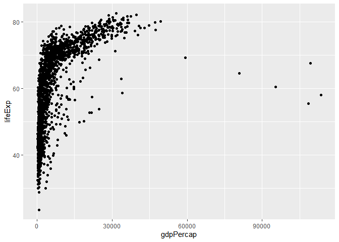
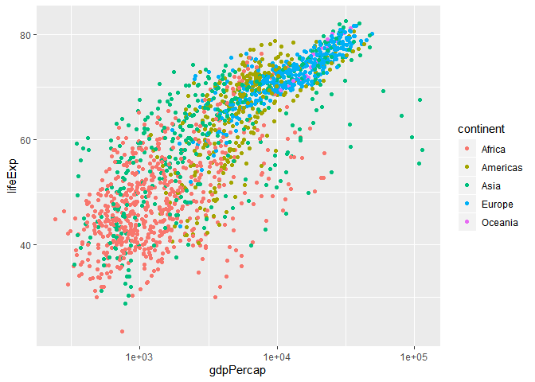

# Introduction

Here is my first RMarkdown document. 
In the YAML (the red text denoting title, author, etc) under output, enter between the colon and "html_document". Enter again, tab, and type fig_caption: yes; enter again, and type toc: yes. This will allow a figure and a table of contents in the end document.

# Let's Embed Some R Code

We'll write a R chunk that loads the tidyverse package and then read in the Gapminder dataset from the subdirectory of my project. To insert a R chunk, type ctrl + alt + i. 


```r
library(tidyverse)
```

```
## -- Attaching packages ------------------------------------------------------------------------------- tidyverse 1.2.1 --
```

```
## v ggplot2 3.2.1     v purrr   0.3.2
## v tibble  2.1.3     v dplyr   0.8.3
## v tidyr   1.0.0     v stringr 1.4.0
## v readr   1.3.1     v forcats 0.4.0
```

```
## -- Conflicts ---------------------------------------------------------------------------------- tidyverse_conflicts() --
## x dplyr::filter() masks stats::filter()
## x dplyr::lag()    masks stats::lag()
```

```r
gm <- read_csv("gapminder.csv")
```

```
## Parsed with column specification:
## cols(
##   country = col_character(),
##   continent = col_character(),
##   year = col_double(),
##   lifeExp = col_double(),
##   pop = col_double(),
##   gdpPercap = col_double()
## )
```


# Investigate the Dataset

Let's take a look at the gm dataset. 


```r
head(gm)
```

```
## # A tibble: 6 x 6
##   country     continent  year lifeExp      pop gdpPercap
##   <chr>       <chr>     <dbl>   <dbl>    <dbl>     <dbl>
## 1 Afghanistan Asia       1952    28.8  8425333      779.
## 2 Afghanistan Asia       1957    30.3  9240934      821.
## 3 Afghanistan Asia       1962    32.0 10267083      853.
## 4 Afghanistan Asia       1967    34.0 11537966      836.
## 5 Afghanistan Asia       1972    36.1 13079460      740.
## 6 Afghanistan Asia       1977    38.4 14880372      786.
```

We have a tibble with country, continent, year, life expectancy, population, and GDP per capita.


# Our First Plot

Showing GDP/capita on X and life expectancy on Y. Specify the figure caption by typing fig.cap="Title" inside the {}. This is referred to as setting the R chunk caption. 


```r
ggplot(gm, aes(x=gdpPercap, y=lifeExp)) +
  geom_point()
```




# A Better Plot

```r
ggplot(gm, aes(x=gdpPercap, y=lifeExp)) +
  geom_point(aes(col=continent))+
  scale_x_log10()
```




# Chunk Options

There are many chunk options. Check them out here: https://yihui.name/knitr/options/
Today, we're most interested in the following:
- echo: TRUE by default; will tell chunk whether to include the code in the output. This is great if you don't want to show all the analysis behind your plot.
- results
  - =hide: results will be hidden
  - =hold: will hold results until the end of the R chunk. This is great if you want to have ALL the code, then ALL the outputs as opposed to code/output, code/output, etc
- include: TRUE by default; if FALSE, then the code will not be run. For example, if you have a View() in your RMarkdown, this allows you to hide the View function in your RMarkdown while keeping it in the code so that it can be analyzed by an additional user
- fig.width, fig.height: used to set dimensions in figure output
- cache: FALSE by default; if TRUE, this saves the results of a given piece of code for the next time you knit it. This is helpful if you're making minute changes and want to re-knit the document several times, but the knitting takes a long time. This way, each chunk will be evaluated for changes since the last time the knitting was performed, and if there are no changes, will just use the last run instead of recomputing. 


# Changing Dimensions

```r
ggplot(gm, aes(x=gdpPercap, y=lifeExp)) +
  geom_point(aes(col=continent))+
  scale_x_log10()
```


  
  
# Writing an R Markdown Table

See some data using head (which is nicely formatted)


```r
head(gm)
```

```
## # A tibble: 6 x 6
##   country     continent  year lifeExp      pop gdpPercap
##   <chr>       <chr>     <dbl>   <dbl>    <dbl>     <dbl>
## 1 Afghanistan Asia       1952    28.8  8425333      779.
## 2 Afghanistan Asia       1957    30.3  9240934      821.
## 3 Afghanistan Asia       1962    32.0 10267083      853.
## 4 Afghanistan Asia       1967    34.0 11537966      836.
## 5 Afghanistan Asia       1972    36.1 13079460      740.
## 6 Afghanistan Asia       1977    38.4 14880372      786.
```

Now make it into a table.

```r
library(knitr)
kable(head(gm))
```


country       continent    year   lifeExp        pop   gdpPercap
------------  ----------  -----  --------  ---------  ----------
Afghanistan   Asia         1952    28.801    8425333    779.4453
Afghanistan   Asia         1957    30.332    9240934    820.8530
Afghanistan   Asia         1962    31.997   10267083    853.1007
Afghanistan   Asia         1967    34.020   11537966    836.1971
Afghanistan   Asia         1972    36.088   13079460    739.9811
Afghanistan   Asia         1977    38.438   14880372    786.1134

If you like tables, look at **gt** table package. (I made this bold by surrounding the word with two asterisks on each side. You can make something italic by surrounding it with one asterisk on each side.) gt uses dplyr. 


# Changing from html to pdf

In the YAML output, change "html" to "pdf". If this doesn't work, there is an error in LaTeX installation, which we'll come back to later. 

GitHub has difficulty publishing html documents. You need a .md file. Go up to the YAML, and under "html_document:" enter "keep_md: yes"


# Now We Knit

Under the title of this script, click Knit > Knit to html. Alternatively, use control + shift + k.

# Let's Share by Using GitHub

Make a new repository in GitHub, leaving R for now. 
